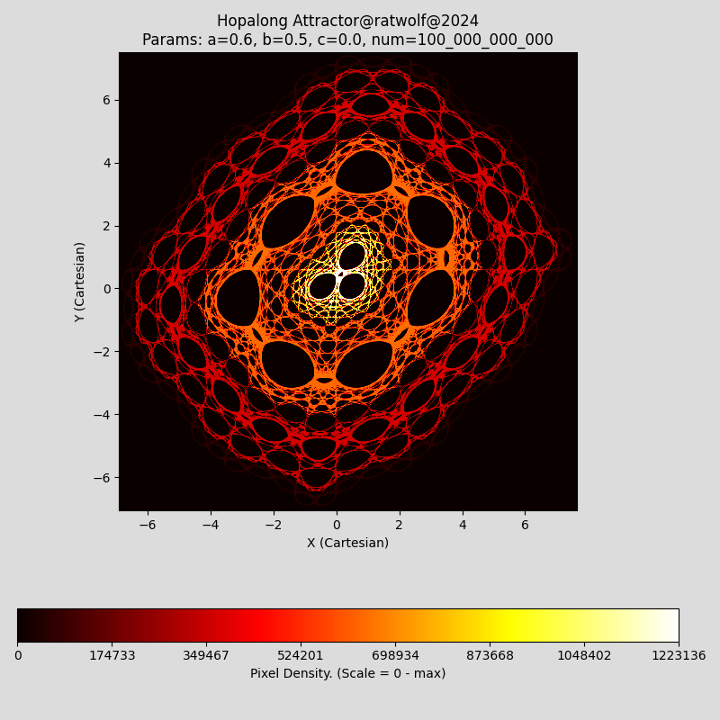
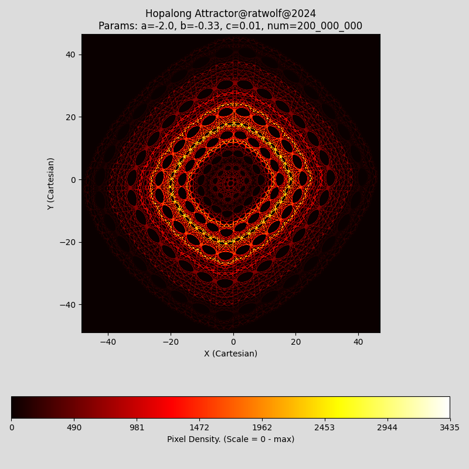
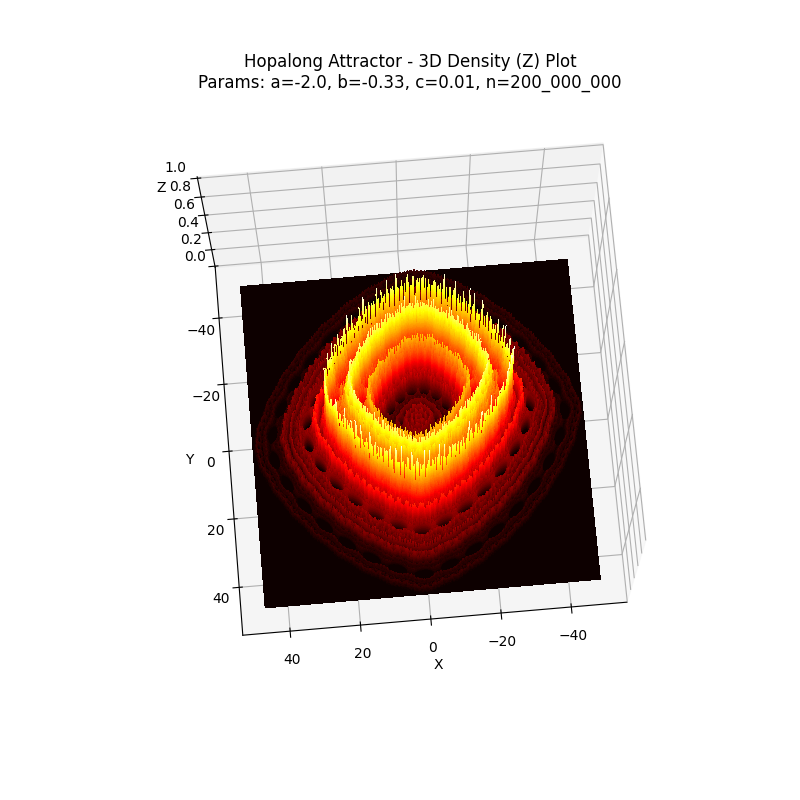
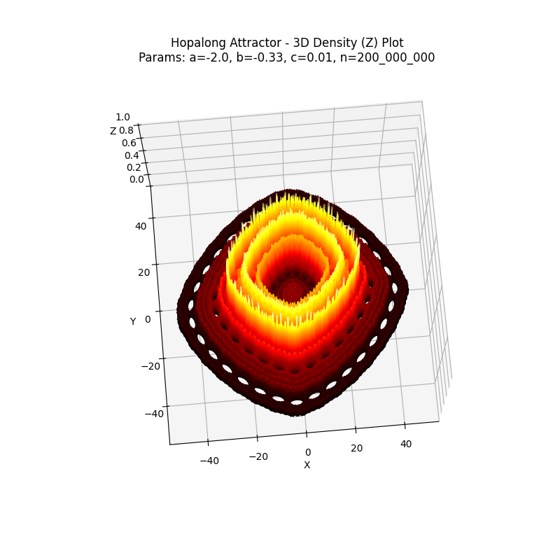
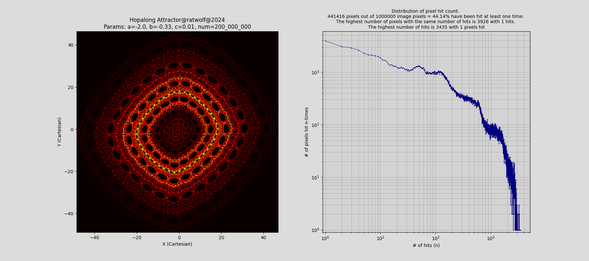
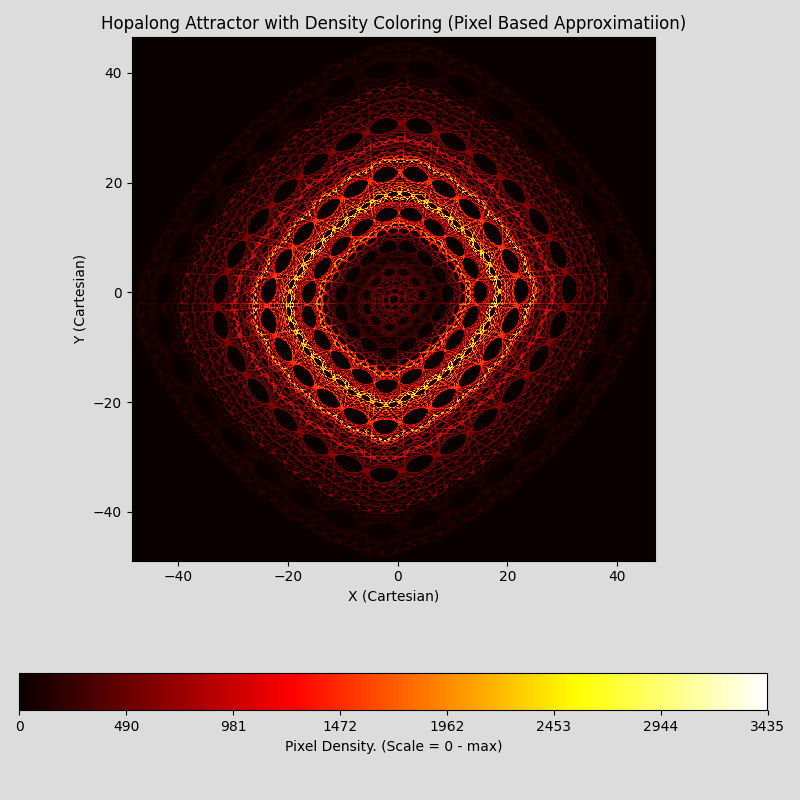
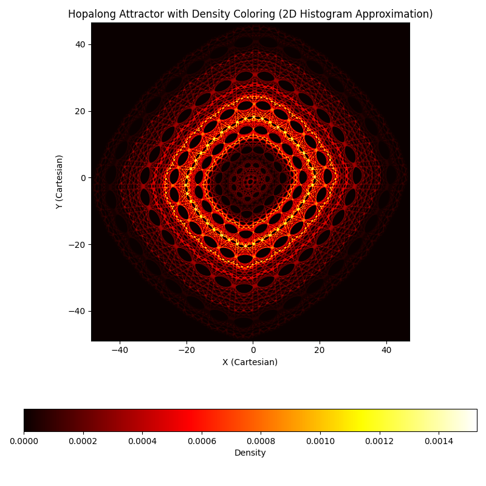
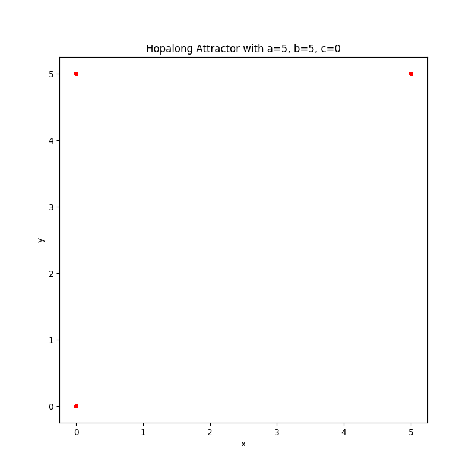
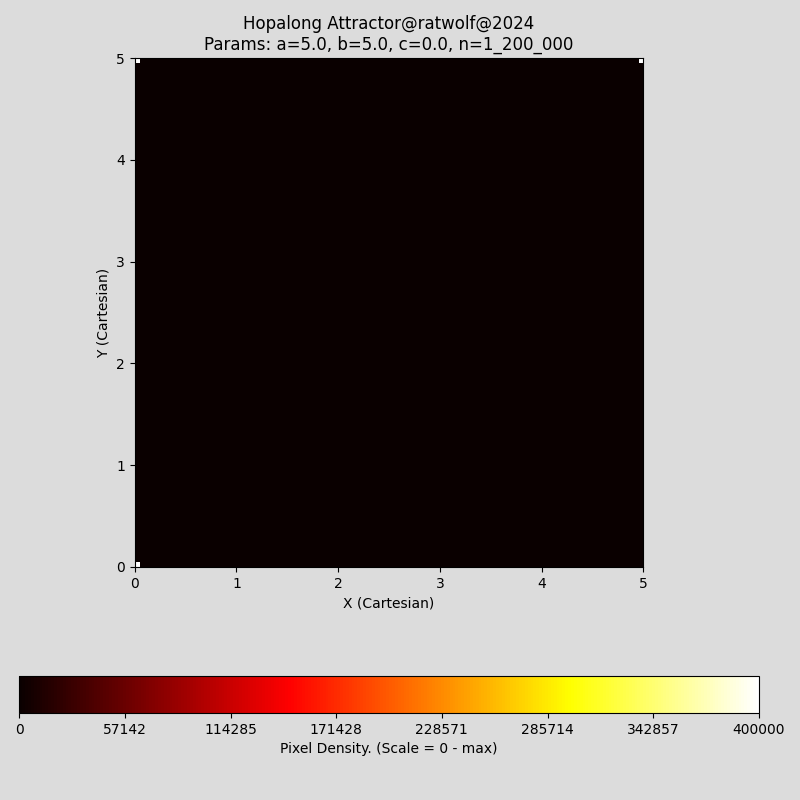
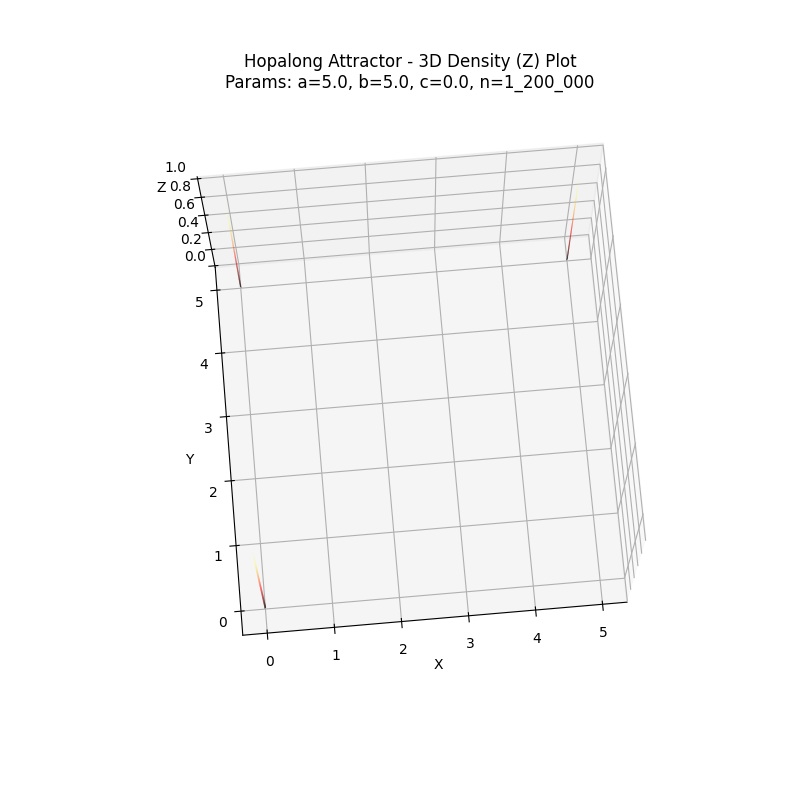

# Calculate & Visualize the Hopalong Attractor with Python

  
- [Calculate \& Visualize the Hopalong Attractor with Python](#calculate--visualize-the-hopalong-attractor-with-python)
  - [Abstract](#abstract)
    - [Historical Context](#historical-context)
    - [The Hopalong Attractor Functions](#the-hopalong-attractor-functions)
    - [Computational Approach](#computational-approach)
  - [Requirements](#requirements)
  - [Usage](#usage)
    - [Input](#input)
    - [Output](#output)
  - [Features, Functionality, and Special Scenarios](#features-functionality-and-special-scenarios)
    - [Program Variants](#program-variants)
    - [Pixel-Based Density Estimation](#pixel-based-density-estimation)
      - [Comparison of Pixel-Based vs. Histogram Density Estimation](#comparison-of-pixel-based-vs-histogram-density-estimation)
      - [Conclusion](#conclusion)
        - [Method Invariance](#method-invariance)
    - [Application of Copysign (Math Module) as a Signum Function](#application-of-copysign-math-module-as-a-signum-function)
    - [Special Constellations and Edge Cases of the Attractor](#special-constellations-and-edge-cases-of-the-attractor)
    - [Optional Features](#optional-features)
  - [Performance Optimization](#performance-optimization)
    - [Just-In-Time Compilation (JIT)](#just-in-time-compilation-jit)
    - [Dummy Calls](#dummy-calls)
    - [Parallelization and Race Conditions](#parallelization-and-race-conditions)
    - [Two-Pass Approach](#two-pass-approach)
    - [Two-Pass Code Section](#two-pass-code-section)
  - [Alternative Solutions](#alternative-solutions)
    - [One-Pass Approach with Full Trajectory Caching\*](#one-pass-approach-with-full-trajectory-caching)
    - [One-Pass Approach with Limited Memory Usage (Chunked or No Caching)\*](#one-pass-approach-with-limited-memory-usage-chunked-or-no-caching)
    - [Potentially Other, More Sophisticated Solutions](#potentially-other-more-sophisticated-solutions)
    - [Summary](#summary)
  - [Recent Code Changes](#recent-code-changes)
  - [Enjoy the Exploration](#enjoy-the-exploration)
  - [References](#references)
    - [References for Python Libraries and Modules](#references-for-python-libraries-and-modules)

## Abstract

### Historical Context

The "*Hopalong*"<top>*<top> attractor, authored by Barry Martin of Aston University in Birmingham, England [[2](#references)],  
was popularized by A.K. Dewdney in the September 1986 issue of *Scientific American*. In Germany, it gained further recognition through a translation titled "*HÜPFER*" in *Spektrum der Wissenschaft* [[3](#references)].  
*Nicknamed by A.K. Dewdney.  

### The Hopalong Attractor Functions

The mathematical definition of the Hopalong attractor is given by the following system of recursive functions:

$$
\large
\begin{cases}
x_{n+1} = y_n - \text{sgn}(x_n) \sqrt{\lvert b x_n - c \rvert} \\
y_{n+1} = a - x_n
\end{cases}
\large
$$

Where:

- The sequence starts from the initial point (x0 , y0) = (0 , 0).
- xn and yn represent the coordinates at the n-th iteration of the attractor.
- a, b, and c are parameters influencing the attractor's dynamics.
- *sgn* is the *signum* function. However, the programs use `math.copysign()` , which is defined as follows:

$$
\text{copysign}(1.0,x) =
\begin{cases}
1.0  & \text{if } & \text{x } & \text{is} &\text{positive}, & \text{0.0} & or &\text{infinity} \\
-1.0 & \text{if } & \text{x } & \text{is} &\text{negative}, & \text{-0.0} & or &\text{negative infinity}
\end{cases}
$$

### Computational Approach

The Python programs calculate and visualize the attractor by iterating the defined system of functions.

Goal:

- Representation of the attractor as a density map to highlight point concentration.
- Calculation with a very high number of iterations at high processing speed and low memory requirements.

Core Algorithm:

Two-pass algorithm with separate calculation of:

1. The spatial extent of the attractor trajectory (first pass).

2. Direct mapping of the sequentially generated floating-point values in continuous space to a discrete pixel grid, while tracking the number of pixel hits to generate the density map (second pass).  
See [Pixel-Based Density Estimation](#pixel-based-density-estimation)

Just-in-time (JIT) compilation is applied and supported by a low-complexity code structure.

For further hints regarding two-pass approach, see [Two-Pass Approach](#two-pass-approach)

[Back to Table of Contents](#calculate--visualize-the-hopalong-attractor-with-python)

## Requirements  

To run the programs, the following Python libraries or modules must be installed / imported:

- matplotlib *
- numpy *  
- numba *
(as of October 26, 2024, Numba only supports Python versions up to 3.12.7. Versions 3.13.x are currently not supported)
- math *
  
(* mandatory)

Optional (for performance tracking):

- time
- resource
  
Import the `time` and `resource` libraries if you want to track process time and system memory usage.  
Otherwise, please comment out the relevant code snippets in the import section and the main() function.
  
    ...

    #import time
    #import resource 
    
    ...
        ...
            # Start the time measurement
            #start_time = time.process_time()

            ...

            # End the time measurement
            #end_time = time.process_time()

            # Calculate the CPU user and system time
            #cpu_sys_time_used = end_time - start_time

            # Calculate the memory resources used
            #memMb=resource.getrusage(resource.RUSAGE_SELF).ru_maxrss/1024.0/1024.0
        
            #print(f'CPU User&System time: {cpu_sys_time_used:.2f} seconds')
            #print (f'Memory (RAM): {memMb:.2f} MByte used')

        ...

[Back to Table of Contents](#calculate--visualize-the-hopalong-attractor-with-python)

## Usage

### Input

When you run the programs, you will be prompted to enter the following parameters, which are crucial for determining the behavior of the Hopalong Attractor:

- **a (float or integer)**: The first parameter affecting the attractor's dynamics.
- **b (float or integer)**: The second parameter affecting the attractor's dynamics.
- **c (float or integer)**: The third parameter affecting the attractor's dynamics.
- **n (integer)**: The number of iterations to run (e.g. 1e6, 1_000_000 or 1000000).

**Example Parameters**:

- a = -2
- b = -0.33
- c = 0.01  
- n = 2e8

Experimenting with different values of these parameters will yield diverse and intricate visual patterns.

### Output

The programs generate a visual representation of the attractor trajectory as a density map, where color intensity reflects the frequency of points visited (hit counts). Lighter areas indicate regions of higher density, highlighting the attractor's intricate structure. This density map also supports a 3D representation by mapping normalized density values along the Z-axis

**Basic Version 2D**

**Basic Version 3D (`contourf3D`)**

**Basic Version 3D (`contour3D`)**

**Extended Version**

[Back to Table of Contents](#calculate--visualize-the-hopalong-attractor-with-python)

## Features, Functionality, and Special Scenarios

### Program Variants

- Basic: Calculates and displays the Hopalong attractor as a 2D density map with an integrated color bar.
  
- Basic 2D/3D: Adds the ability to visualize the attractor in 3D by mapping normalized density values along the Z-axis. Users can select the visualization mode at runtime.
  
- Extended: Incorporates all features of the Basic version (except the color bar) and includes additional statistics as well as a visualization of the pixel hit count distribution.
  
**Note:**  
The code for the Basic variant supports both 2D and 3D visualization. To switch modes, comment out the relevant `render_trajectory_image function` .Alternatively, use the 2D/3D variant to select the visualization mode during runtime.

[See Recent Code Changes](#recent-code-changes)

[Back to Table of Contents](#calculate--visualize-the-hopalong-attractor-with-python)

Examples of outputs can be found in the "Usage" section above.

### Pixel-Based Density Estimation

- **Continuous Point to Discrete Pixel Mapping**  
  Trajectory points, represented as floating-point coordinates in a two-dimensional continuous space, are mapped to integer pixel coordinates for visualization. Scaling factors, derived from the trajectory's extents (minimum and maximum values) and the image dimensions, ensure that the continuous coordinates fit within the pixel grid while preserving spatial relationships.

- **Integer Conversion**  
  Floating-point coordinates are converted to integer pixel locations. This step introduces quantization: closely spaced trajectory points in continuous space may map to the same pixel, resulting in multiple "hits" per pixel. This discretization aggregates local density but may reduce fine details due to grouping within the pixel grid.

- **Density Representation**  
  An image array, initialized with zeros, serves as a blank canvas. Each trajectory point, after being mapped to a pixel, increments the corresponding array index. Higher hit counts in the array indicate greater density, approximating local concentrations of points. The total sum of pixel hit counts matches the number of trajectory iterations, preserving the dataset's size.

- **Density Visualization**  
  The Matplotlib "hot" colormap is applied to represent pixel hit counts as colors. The colormap normalizes these counts to fit within its color space, where darker colors correspond to lower densities and lighter colors to higher densities, creating a gradient that highlights areas of activity.

  - **Image resolution directly impacts the visual density and detail:**
  
    - Lower resolutions result in higher visual density contrast due to the grouping of multiple trajectory points into fewer pixels. This concentrates hit counts and emphasizes differences between regions of perceived high and low density, as visualized by the colormap.
    This enhances visual clarity but reduces detail due to the coarser grid.

    - Higher resolutions distribute trajectory points across more pixels, capturing finer variations in the data and increasing detail. However, this reduces visual density contrast because hit counts are spread more evenly, diminishing the apparent differences between regions of perceived high and low density in the colormap.

  While smoothing techniques like `scipy.ndimage.gaussian_filter` can enhance visual density contrast, they alter raw hit counts and are not included here to preserve data integrity.

#### Comparison of Pixel-Based vs. Histogram Density Estimation

1. **Pixel-Based Density Estimation**:
  
   Continuous trajectory points are mapped to discrete pixel coordinates. The density estimation and the creation of a density matrix (pixel grid) occur simultaneously as a direct result of quantization and discretization.
   - Image resolution directly impacts the visual density and detail:  
     - Lower resolutions (coarser grids) enhance visual density contrast but reduce detail.
  
     - Higher resolutions (finer grids) increase detail but reduce visual density contrast.

2. **Histogram Density Estimation**:  

   NumPy's `np.histogram2d(..., density=True)` discretizes continuous space into a grid of equal-sized bins. It counts the number of points falling into each bin and calculates the density by normalizing these counts relative to the total number of points and bin area. This normalization ensures that the density values represent relative point distributions across the entire space, producing a density matrix suitable for quantitative analysis.
   - Bin size affects density precision:  
     - Smaller bins (higher number of bins) result in finer resolution of the density estimate, as each bin represents a smaller region of the space and captures more detailed variations in the data. However, this reduces density contrast because normalized density values are distributed over more bins, making differences between regions of high and low density less pronounced

     - Larger bins (lower number of bins) average densities over broader regions, resulting in a smoother, less detailed density estimate. However, this increases density contrast by concentrating normalized density values in fewer, larger bins, making differences between regions of high and low density more pronounced

Visualization of density matrices can be done seperately for both methods in a flexible manner.

#### Conclusion

For the present application, pixel-based density estimation is a promising alternative to histogram-based density estimation.
Both methods can effectively capture and highlight areas with point concentrations. This is illustrated in the following images.  

Each approach offers distinct advantages and considerations:

- The **pixel-based approach** is ideal for visual exploration, supporting the implementation of fast algorithms and excelling in computations involving a large number of iterations
- The **histogram-based approach** excels in statistical and numerical analyses, offering a more precise representation of density distributions in continuous space.

##### Method Invariance

Despite variations in density estimation techniques (pixel-based or histograms) and visualization settings (such as resolution or bin size), the underlying geometric structure of the attractor remains unchanged. These methods influence how density is represented but do not alter the attractor's intrinsic shape or dynamics, which are determined by the underlying mathematical functions.

**1. Pixel Based Approximation**

**2. 2D Histogram Approximation**

[Back to Table of Contents](#calculate--visualize-the-hopalong-attractor-with-python)

### Application of Copysign (Math Module) as a Signum Function

The programs leverage the `math.copysign` function, `copysign(x, y)`, which returns a float value with the magnitude (absolute value) of *x* but the sign of *y*. On platforms that support signed zeros, `copysign(1.0, -0.0)` correctly evaluates to *-1.0*.

The copysign function can serve as a substitute for the standard signum function, and is defined as follows:

$$
\text{copysign}(1.0,x) =
\begin{cases}
1.0  & \text{if } & \text{x } & \text{is} &\text{positive}, & \text{0.0} & or &\text{infinity} \\
-1.0 & \text{if } & \text{x } & \text{is} &\text{negative}, & \text{-0.0} & or &\text{negative infinity}
\end{cases}
$$

This adjustment alters the behavior of certain parameter sets, often leading to intricate, fractal-like patterns instead of periodic orbits or fixed-point dynamics.

Periodic Orbits Defined:  
Periodic orbits are trajectories in which the system revisits the same state after a fixed number of iterations.

Example Parameters Yielding Intricate Patterns When Using `copysign`:

- a = 1, b = 2, c = 3 or  

- a = 0, b = 1, c = 1 or  

- a = 1, b =1, c = 1

### Special Constellations and Edge Cases of the Attractor

Certain parameter sets lead to periodic or near-periodic orbits, even when using the `copysign` function. In these cases, the attractor's trajectory revisits a limited number of distinct points repeatedly, resulting in high-density cycles. Such cycles frequently occur at the attractor's boundary.

Example Parameter Sets:

- 1: a = p , b = 0, c = 0

- 2: a = p, b = 0, c = p

- 3: a = p, b = p, c = 0
  
Here, *p* is a constant parameter ($p\neq 0$), unchanged within each set.

**Case Analysis:**  

Parameter Set 3 (a=p, b=p, c=0)

For this parameter set, the Hopalong functions are:

$$
\large
\begin{cases}
x_{n+1} = y_n - \text{sgn}(x_n) \sqrt{\lvert p x_n \rvert} \\
y_{n+1} = p - x_n
\end{cases}
\large
$$

With p>0, the system settles into a 3-cycle:  *(0,0)→(0,p)→(p,p)→(0,0)*.

The pixel density simplifies to n / 3, where *n* is the number of iterations.

**Example:**  

- Parameters: a=5, b=5, c=0
- Iterations: 1,200,000

**Observations:**  

The 3-cycle structure dominates, with "high-density" pixels clustering along the attractor's extent boundaries.

**Visualization Recommendation:**

For edge cases, reduce the image resolution (e.g., 100×100) to better highlight the boundaries of the attractor.  
For example:

    def main(image_size=(100, 100), color_map='hot'):

This scenario is an ideal use case for the features of the extended program variant, such as pixel hit count statistics, to analyze high-density cycle behavior.

[Back to Table of Contents](#calculate--visualize-the-hopalong-attractor-with-python)

### Optional Features

Execution time and resources: Measurement starts after user input and records the CPU time for the entire process, including image rendering. It also tracks the system memory used.

Note: Since user interactions with the plot window, such as zooming, panning, or mouse movements, are also measured, it is recommended to close the plot window automatically. This can be achieved using the commands `plt.pause(1)` followed by `plt.close(fig)` . As long as there is no interaction with the plot window, the pause time from `plt.pause()` is not recorded by the `time.process_time()` function.

        #plt.show()
        plt.pause(1)
        plt.close(fig)

[Back to Table of Contents](#calculate--visualize-the-hopalong-attractor-with-python)

## Performance Optimization  

### Just-In-Time Compilation (JIT)

The programs leverage the Numba JIT just-in-time compilation for performance optimization. This avoids the overhead of Python's interpreter, providing a significant speedup over standard Python loops. JIT compilation translates Python code into machine code at runtime, allowing for more efficient execution of loops and mathematical operations.
  
### Dummy Calls

Dummy calls are preliminary invocations of JIT-compiled functions that prompt the Numba compiler to generate machine code before the function is used in the main execution flow. This ensures that the function is precompiled, avoiding compilation overhead during its first actual execution. This process is akin to "eager compilation," as it occurs ahead of time, but it does not require explicit function signatures in the header.

### Parallelization and Race Conditions

The parallel loop function `prange` from the Numba library is not suitable for cross-iteration dependencies, such as those encountered when iterating recursive functions. While it is possible to restructure the second pass to use prange for populating the image array, this could introduce race conditions—situations where multiple threads access and modify shared data simultaneously, leading to inconsistent or unpredictable results. Therefore, this approach was not implemented.

[Back to Table of Contents](#calculate--visualize-the-hopalong-attractor-with-python)

### Two-Pass Approach

By separating the extent calculation (first pass) from trajectory point mapping (second pass), this approach allows for efficient sequential processing. Knowing the overall trajectory extents in advance enables direct and efficient mapping of points to image pixels, optimizing memory usage and maintaining consistent performance.

Advantages:

- Memory Efficiency: The two-pass approach reduces memory requirements by recalculating trajectory points, eliminating the need for large-scale caching.  
  
- JIT Compatibility: The simple, sequential structure is well-suited for Just-In-Time (JIT) compilation, enhancing execution speed.  
  
- Scalability: As the number of iterations grows, the two-pass approach’s efficiency in memory usage and processing speed becomes much more advantageous.

Disadvantage: Trajectory points must be computed in both passes, but this trade-off is minimal. As the number of iterations increases, the benefits of memory efficiency and processing speed outweigh this drawback

### Two-Pass Code Section

    @njit #njit is an alias for nopython=True
    def compute_trajectory_extents(a, b, c, n):
        # Dynamically compute and track the minimum and maximum extents of the trajectory over 'n' iterations.
        x = np.float64(0.0)
        y = np.float64(0.0)

        min_x = np.inf  # ensure that the initial minimum is determined correctly
        max_x = -np.inf # ensure that the initial maximum is determined correctly
        min_y = np.inf
        max_y = -np.inf

        for _ in range(n):
        # selective min/max update using direct comparisons avoiding min/max function
            if x < min_x:
                min_x = x
            if x > max_x:
                max_x = x
            if y < min_y:
                min_y = y
            if y > max_y:
                max_y = y
            # signum function respecting the behavior of floating point numbers according to IEEE 754 (signed zero)
            xx = y - copysign(1.0, x) * sqrt(fabs(b * x - c))
            yy = a-x
            x = xx
            y = yy
        
        return min_x, max_x, min_y, max_y

    # Dummy call to ensure the function is pre-compiled by the JIT compiler before it's called by the interpreter.
    _ = compute_trajectory_extents(1.0, 1.0, 1.0, 2)

    @njit
    def compute_trajectory_and_image(a, b, c, n, extents, image_size):
        # Compute the trajectory and populate the image with trajectory points
        image = np.zeros(image_size, dtype=np.uint64)
    
        # pre-compute image scale factors
        min_x, max_x, min_y, max_y = extents
        scale_x = (image_size[1] - 1) / (max_x - min_x) # column
        scale_y = (image_size[0] - 1) / (max_y - min_y) # row
    
        x = np.float64(0.0)
        y = np.float64(0.0)
    
        for _ in range(n):
            # map trajectory points to image pixel coordinates
            px = np.uint64((x - min_x) * scale_x)
            py = np.uint64((y - min_y) * scale_y)
            # populate the image arrayy "on the fly" with each computed point
            image[py, px] += 1  # respecting row/column convention, update # of hits

            # Update the trajectory "on the fly"
            xx = y - copysign(1.0, x) * sqrt(fabs(b * x - c))
            yy = a-x
            x = xx
            y = yy
        
        return image

    # Dummy call to ensure the function is pre-compiled by the JIT compiler before it's called by the interpreter.
    _ = compute_trajectory_and_image(1.0, 1.0, 1.0, 2, (-1, 0, 0, 1), (2, 2)) 

[Back to Table of Contents](#calculate--visualize-the-hopalong-attractor-with-python)

## Alternative Solutions

While the two-pass approach is the primary solution, it’s valuable to consider alternative one-pass methods, each with unique trade-offs in performance, memory usage, and complexity. Here’s an overview:

### One-Pass Approach with Full Trajectory Caching*

Description: This method computes all trajectory points in a single pass and stores them in memory, enabling efficient calculation of trajectory extents and mapping to image pixels.  

- Advantages: Leveraging NumPy’s vectorized operations, this approach efficiently computes and maps points in a single pass, potentially increasing performance.
  
- Disadvantages:  
Full caching requires substantial memory, especially for high iteration counts. This may lead to performance issues from system memory swapping or even memory overflow.

### One-Pass Approach with Limited Memory Usage (Chunked or No Caching)*

Description: These approaches attempt to reduce memory consumption by either processing the trajectory in chunks or not caching trajectory points at all. However, since the full trajectory extents are unknown at the outset, each variation faces the same limitation: pixel mappings require recalculating because trajectory extents change (floating points in continuous space).  

Chunked: The trajectory is divided into manageable chunks, each cached temporarily.  
No Caching: Points are computed and mapped to pixels directly without storing them.  

- Advantages: Limits memory usage.

- Disadvantages: Both approaches become impractical due to the following major limitations:
Data Loss and Inaccuracy: As previously computed floating-point values are irrecoverably mapped to integer pixel coordinates, it becomes impossible to retrieve the exact values for remapping, leading to data loss and inconsistencies.  

*This also applies analogously to any versions that only process floating point values.

### Potentially Other, More Sophisticated Solutions

No other one-pass method solutions have been investigated or considered to date. More sophisticated solutions would also contradict the minimum complexity design approach unless a significant performance improvement in calculations with a high number of iterations makes them worth considering.

### Summary

Overall, the two-pass approach strikes the best balance between speed, efficiency and simplicity and is therefore ideal for attractor calculations with a high number of iterations. Although the trajectory points need to be computed in both passes, the pitfalls of alternative solutions are avoided.

[Back to Table of Contents](#calculate--visualize-the-hopalong-attractor-with-python)

## Recent Code Changes

OPTIONAL: Using a 3D plot by mapping normalized density values along the Z-axis.

    """
    def render_trajectory_image(image, extents, params, color_map):
        # Render the trajectory image in 3D
        # Create a meshgrid for X and Y coordinates
        x = np.linspace(extents[0], extents[1], image.shape[1])
        y = np.linspace(extents[2], extents[3], image.shape[0])
        x, y = np.meshgrid(x, y)

        # Plot with normalized density (hit count) as Z values
        z = image / np.max(image) if np.max(image) > 0 else image

        fig = plt.figure(figsize=(8, 8))
        ax = fig.add_subplot(111, projection='3d')
        ax.contourf3D(x, y, z, levels=100, cmap=color_map)

        # Customize the plot
        ax.set_title(f'Hopalong Attractor - 3D Density (Z) Plot\nParams: a={params["a"]}, b={params["b"]}, c={params["c"]}, n={params["n"]:_}')
        ax.set_xlabel('X')
        ax.set_ylabel('Y')
        ax.set_zlabel('Z')
        ax.view_init(elev=75, azim=-95)  # Adjust angle for better view

        plt.show()
    """
[Back to Table of Contents](#calculate--visualize-the-hopalong-attractor-with-python)  

## Enjoy the Exploration

- Explore the attractor in three dimensions by mapping normalized density values along the Z-axis.  
You can try `ax.contourf3D` (Filled Contours) or `ax.contour3D` (Unfilled Contours).

- Experiment with different image resolutions, color maps, or ways of populating the image array beyond using the hit count to explore new visual perspectives.  

[Also check out my simpler Rust version](https://github.com/ratwolfzero/hopalong)

Copyright © 2024 Ralf Becker, Nuremberg  
Contact: <ratwolf@duck.com>  

[MIT License](https://github.com/ratwolfzero/hopalong_python/blob/main/Copyright.pdf)

----------------------------------------------------------------------------------------------------------------------------------------------------

## References

[1]  
**J. Lansdown and R. A. Earnshaw (eds.)**, *Computers in Art, Design and Animation*.  
 New York: Springer-Verlag, 1989.  
 e-ISBN-13: 978-1-4612-4538-4.  

[2]  
**Barry Martin**, "Graphic Potential of Recursive Functions," in *Computers in Art, Design and Animation* [1],  
pp. 109–129.

[3]  
**A.K. Dewdney**, Program "HÜPFER," in *Spektrum der Wissenschaft: Computer Kurzweil*.  
Spektrum der Wissenschaft Verlagsgesellschaft mbH & Co., Heidelberg, 1988.  
(German version of *Scientific American*).  
ISBN-10: 3922508502, ISBN-13: 978-3922508502.

[Back to Abstract](#abstract)

----------------------------------------------------------------------------------------------------------------------------------------------------

### References for Python Libraries and Modules

1. [NumPy Documentation](https://numpy.org/doc/stable/): NumPy is a fundamental package for scientific computing in Python.
2. [Matplotlib Documentation](https://matplotlib.org/stable/contents.html): A library for creating static, interactive, and animated visualizations.
3. [Numba Documentation](https://numba.readthedocs.io/): Numba is a just-in-time compiler for optimizing numerical computations.
4. [Python Built-in Functions](https://docs.python.org/3/library/functions.html): Overview of built-in functions available in Python.
5. [Python Math Module](https://docs.python.org/3/library/math.html): Access mathematical functions defined by the C standard.
6. [Python Time Module](https://docs.python.org/3/library/time.html#module-time): Time access and conversions.
7. [Python Resource Module](https://docs.python.org/3/library/resource.html): Interface for getting and setting resource limits.

[Back to Table of Contents](#calculate--visualize-the-hopalong-attractor-with-python)
