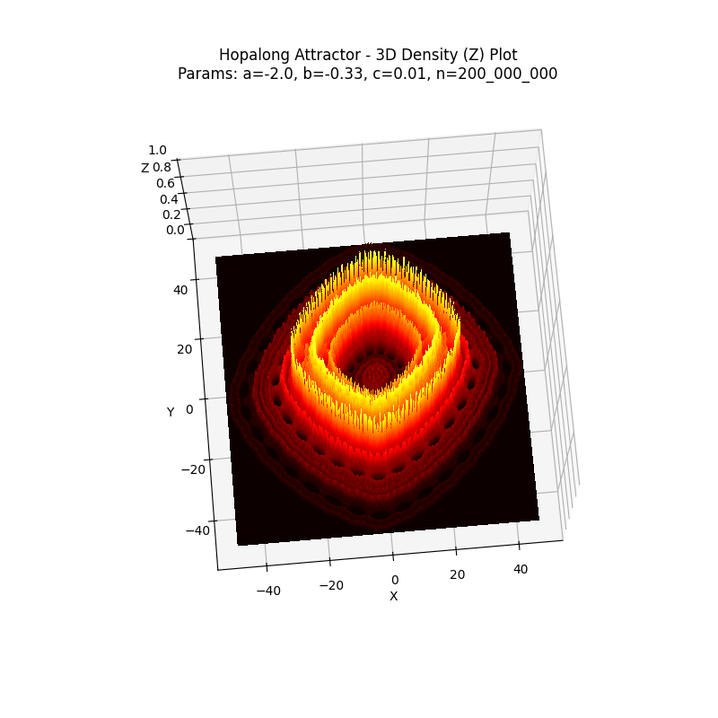
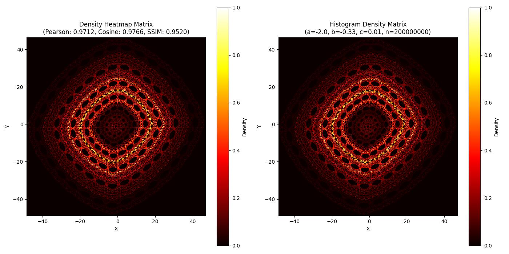

<!--markdownlint-disable MD033 MD041-->

# Calculate & Visualize the Hopalong Attractor with Python

  
- [Calculate \& Visualize the Hopalong Attractor with Python](#calculate--visualize-the-hopalong-attractor-with-python)
  - [Abstract](#abstract)
    - [Historical Context](#historical-context)
    - [The Hopalong Attractor Functions](#the-hopalong-attractor-functions)
    - [Computational Approach](#computational-approach)
  - [Requirements](#requirements)
  - [Usage](#usage)
    - [Input](#input)
    - [Output](#output)
  - [Features, Functionality, and Special Scenarios](#features-functionality-and-special-scenarios)
    - [Program Variants](#program-variants)
    - [Pixel-Based Density Approximation](#pixel-based-density-approximation)
      - [Comparison of Pixel-Based Density Approximation vs. Histogram-Based Density Estimation](#comparison-of-pixel-based-density-approximation-vs-histogram-based-density-estimation)
        - [Pixel-Based Approximation](#pixel-based-approximation)
        - [Histogram-Based Estimation](#histogram-based-estimation)
      - [Visualization of Aggregated Density Distribution](#visualization-of-aggregated-density-distribution)
      - [Summary](#summary)
      - [Conclusions](#conclusions)
    - [Application of Copysign (Math Module) as a Signum Function](#application-of-copysign-math-module-as-a-signum-function)
    - [Special Constellations and Edge Cases of the Attractor](#special-constellations-and-edge-cases-of-the-attractor)
    - [Optional Features](#optional-features)
  - [Performance Optimization](#performance-optimization)
    - [Just-In-Time Compilation (JIT)](#just-in-time-compilation-jit)
    - [Dummy Calls](#dummy-calls)
    - [Parallelization and Race Conditions](#parallelization-and-race-conditions)
    - [Two-Pass Approach](#two-pass-approach)
    - [Two-Pass Code Section](#two-pass-code-section)
  - [Alternative Solutions](#alternative-solutions)
    - [One-Pass Approach with Full Trajectory Caching\*](#one-pass-approach-with-full-trajectory-caching)
    - [One-Pass Approach with Limited Memory Usage (Chunked or No Caching)\*](#one-pass-approach-with-limited-memory-usage-chunked-or-no-caching)
    - [Potentially Other, More Sophisticated Solutions](#potentially-other-more-sophisticated-solutions)
    - [Recap](#recap)
  - [Recent Code Changes](#recent-code-changes)
  - [Enjoy the Exploration](#enjoy-the-exploration)
  - [License](#license)
  - [References](#references)
    - [References for Python Libraries and Modules](#references-for-python-libraries-and-modules)
  - [Mathematical Appendix](#mathematical-appendix)
    - [Notations for Pixel-Based Density Approximation](#notations-for-pixel-based-density-approximation)
      - [Continuous to Discrete Mapping](#continuous-to-discrete-mapping)
      - [Tracking of Density Accumulation](#tracking-of-density-accumulation)
      - [Total Hit Count](#total-hit-count)

## Abstract

### Historical Context

The "*Hopalong*"<top>*<top> attractor, authored by Barry Martin of Aston University in Birmingham, England [[2](#references)],  
was popularized by A.K. Dewdney in the September 1986 issue of *Scientific American*. It gained further notoriety in Germany through an algorithm called *“HÜPFER”* in *Spektrum der Wissenschaft* [[3](#references)].  
*Nicknamed by A.K. Dewdney.  

### The Hopalong Attractor Functions

The mathematical definition of the Hopalong attractor is given by the following system of recursive functions, defined in [[2](#references)]:

$$
\large
\begin{cases}
x_{n+1} = y_n - \text{sgn}(x_n) \sqrt{\lvert b x_n - c \rvert} \\
y_{n+1} = a - x_n
\end{cases}
\large
$$

Where:

- The sequence starts from the initial point (x0 , y0) = (0 , 0).
- xn and yn represent the coordinates at the n-th iteration of the attractor.
- a, b, and c are parameters influencing the attractor's dynamics.
- *sgn* is the *signum* function. However, the programs use [`math.copysign()`](#application-of-copysign-math-module-as-a-signum-function) , which is defined as follows:

$$
\text{copysign}(1.0,x) =
\begin{cases}
1.0  & \text{if } & \text{x } & \text{is} &\text{positive}, & \text{0.0} & or &\text{infinity} \\
-1.0 & \text{if } & \text{x } & \text{is} &\text{negative}, & \text{-0.0} & or &\text{negative infinity}
\end{cases}
$$

### Computational Approach

The available Python programs calculate and visualize the attractor by iterating the described function system.

Goal:

- **Visual Representation**:
The attractor is rendered as a density heatmap, with color intensity reflecting areas of high or low point concentration.

- **Efficiency**:
Large numbers of iterations are computed with low memory usage and high processing speed.

Core Algorithm:

The algorithm consists of two main passes:

- **First Pass**: Determines the spatial extent of the attractor trajectory.

- **Second Pass**: Maps the sequentially generated trajectory points in continuous space directly to a discrete pixel grid, keeping track of the number of pixel hits used to generate the density heatmap matrix.  
For a more in-depth look, consult [Pixel-Based Density Approximation](#pixel-based-density-approximation)

Just-in-time (JIT) compilation is applied and supported by a low-complexity code structure.

For details regarding two-pass strategy, see [Two-Pass Approach](#two-pass-approach)

[Back to Table of Contents](#calculate--visualize-the-hopalong-attractor-with-python)

---

## Requirements  

To run the programs, the following Python libraries or modules must be installed / imported:

- matplotlib *
- numpy *  
- numba *
- math *
  
(* mandatory)

Optional (for performance tracking):

- time
- resource
  
Import the `time` and `resource` libraries if you want to track process time and system memory usage.
Otherwise, please comment out the corresponding code fragments in the import section, the corresponding function and in the main function.
  
    ...

    #import time
    #import resource 
    
    ...

    """
    def calculate_and_display_resource_usage(start_time, end_time):
    # Calculate the CPU user and system time
    cpu_sys_time_used = end_time - start_time

    # Calculate the memory resources used
    memMb = resource.getrusage(resource.RUSAGE_SELF).ru_maxrss / 1024.0 / 1024.0

    print(f'CPU User&System time: {cpu_sys_time_used:.2f} seconds')
    print(f'Memory (RAM): {memMb:.2f} MByte used')
    """

        ...
            # Start the time measurement
            #start_time = time.process_time()

            ...

            # End the time measurement
            #end_time = time.process_time()
         
            #calculate_and_display_resource_usage(start_time, end_time)
        ...

[Back to Table of Contents](#calculate--visualize-the-hopalong-attractor-with-python)

---

## Usage

### Input

When you run the programs, you will be prompted to enter the following parameters, which determine the behavior of the Hopalong Attractor:

- **a (float or integer)**: The first parameter affecting the attractor's dynamics.
- **b (float or integer)**: The second parameter affecting the attractor's dynamics.
- **c (float or integer)**: The third parameter affecting the attractor's dynamics.
- **n (integer)**: The number of iterations to run (e.g. 1e6, 1_000_000 or 1000000).

**Example Parameters**:

- a = -2
- b = -0.33
- c = 0.01  
- n = 2e8

Experimenting with different values of these parameters will yield diverse and intricate visual patterns.

### Output

The programs generate a visual representation of the attractor trajectory as a density heatmap, where color intensity reflects the frequency of points visited (hit counts). Lighter areas indicate regions of higher density, highlighting the attractor's intricate structure. The generated density heatmap matrix also supports a 3D representation by mapping normalized density values along the Z-axis.

**Basic Version 2D**

**Basic Version 3D `ax.contourf3D`**

**Basic Version 3D `ax.contour3D`**

**Extended Version**

[Back to Table of Contents](#calculate--visualize-the-hopalong-attractor-with-python)

---

## Features, Functionality, and Special Scenarios

### Program Variants

- Basic: Calculates and displays the Hopalong attractor as a 2D density heatmap with an integrated color bar.
  
- Basic 2D/3D: Adds the ability to visualize the attractor in 3D by mapping normalized density values along the Z-axis. Users can select the visualization mode at runtime.
  
- Extended: Incorporates all features of the Basic version (except the color bar) and includes additional statistics as well as a visualization of the pixel hit count distribution.

Examples of outputs can be found in the "Usage" section above.

[Back to Table of Contents](#calculate--visualize-the-hopalong-attractor-with-python)

---

### Pixel-Based Density Approximation

- **Continuous to Discrete Mapping**  
  Trajectory points, represented as floating-point coordinates in a two-dimensional continuous space, are scaled and mapped to integer pixel coordinates for visualization. Scaling factors derived from the trajectory's extents and the image dimensions ensure the continuous coordinates fit within the pixel grid while preserving spatial relationships.

- **Integer Conversion by Rounding to Nearest Integer**  
  Integer conversion during continuous-to-discrete mapping introduces quantization, where closely spaced trajectory points may map to the same pixel due to the quantization of coordinates. Together with the preceding steps, this forms the discretization process, aggregating local density within the pixel grid. However, the grouping effect may reduce fine details.

- **Tracking of Density Aggregation**  
  An image array, initialized with zeros, serves as a blank canvas for recording density. Each trajectory point, after being mapped to a pixel, increments the value at the corresponding array index. The resulting array is referred to as the **Density Heatmap Matrix**. Pixel hit counts encode the spatial distribution of trajectory point densities in continuous space. Higher hit counts indicate greater density.  
  
  Note: The total sum of pixel hit counts equals the number of trajectory iterations, as each iteration contributes one pixel, which may be hit multiple times, to the density heatmap matrix.

  For mathematical definition, see:[Mathematical Appendix:](#mathematical-appendix)

#### Comparison of Pixel-Based Density Approximation vs. Histogram-Based Density Estimation

##### Pixel-Based Approximation
  
This ***generative method*** creates a density heatmap matrix by mapping trajectory points directly to discrete pixels. Each pixel corresponds to a specific region in continuous space, with emergent density patterns arising from the interaction between the attractor's dynamics and the discretization process.

- Impact of Image Resolution:
  
  - Lower resolutions increase visual density contrast by grouping multiple trajectory points into fewer pixels. This concentrates hit counts, emphasizing density differences but reducing detail.

  - Higher resolutions distribute trajectory points across more pixels, capturing finer data variations and increasing detail but reducing visual density contrast as hit counts are spread more evenly.

##### Histogram-Based Estimation  

Using `np.histogram2d(..., density=True)`, this ***analytic method*** divides the continuous space into a grid of equal-area bins and counts the number of trajectory points that fall into each bin. The counts are then normalized by the total number of points and the bin area, resulting in a density matrix representing relative point distributions across the entire space for quantitative analysis. The density patterns, similar to the pixel-based approach, arise from the interplay between the attractor's dynamics and the bin grid configuration.

- Impact of bin size:

  - Smaller bins (higher bin count) improve density precision but reduce density contrast by spreading density over more bins.

  - Larger bins (lower bin count) increase density contrast by concentrating normalized density values in fewer, larger bins but reduce precision.

Note: Kernel Density Estimation (KDE) may provide more accurate density estimates, especially in scenarios such as the Hopalong attractor where dense and sparse regions coexist, as it smoothes and adjusts for such variations. However, due to the high computational cost, it was unsuitable for this study. Similarly, smoothing the density heatmap matrix using `scipy.ndimage.gaussian_filter`, which resembles a KDE-like effect, was avoided as it changes the number of pixel hits despite improving visualization.

#### Visualization of Aggregated Density Distribution

The Matplotlib "hot" colormap represents pixel hit counts (in pixel-based density approximation) and histogram bin counts (in histogram-based density estimation) as colors, scaled to span the full range of the colormap. Darker colors correspond to lower densities, while lighter colors correspond to higher densities, creating a gradient that highlights areas of activity.

#### Summary

Pixel-based density approximation presents a promising alternative to histogram-based density estimation, each offering distinct advantages:

- Qualitative: The pixel-based approach is well-suited for visual exploration and supports fast algorithms that efficiently handle large numbers of iterations. This efficiency arises from its ability to directly update the density heatmap matrix sequentially. For details, see [Two-Pass Approach](#two-pass-approach).
  
- Quantitative: The histogram-based approach accurately estimates the normalized density distribution in continuous space. However, it usually requires caching all data points in advance to ensure accurate binning and normalization, which results in significant memory consumption. Sequential processing seems possible but quite challenging.  

#### Conclusions

Both the pixel-based density approximation (heatmap) and histogram-based density estimation effectively highlight areas of point concentrations during **visualization**. This is demonstrated in the following comparison panel showcasing a normalized density heatmap and histogram density matrix, along with a quantitative comparison.

For consistency, both the image resolution and the number of bins were set to 1000 × 1000. This ensures that the pixel grid and the bin grid have the same number of elements, allowing for meaningful visual and quantitative comparisons between the two methods.

The images were rendered as follows:

- **Density Heatmap Matrix**: used `matplotlib.pyplot.imshow` with the calculated trajectory extents. The interpolation='none' parameter ensures that no smoothing is applied, preserving the discrete pixel values.
- **Histogram Density Matrix**: used `matplotlib.pyplot.pcolormesh` with the bin edges calculated from `numpy.histogram2d`. The antialiased=False parameter ensures that the discrete bin boundaries are preserved during visualization.

**Visual Side-by-Side Comparison**  
**Parameters**: a = -2, b = -0.33, c = 0.01  
**Number of Iterations**: 2 × 10^8  
**Image size (pixels) / bin size (bins)**: 1000 × 1000  

  

**Quantitative Comparison of Normalized Density Heatmap and Histogram Density Matrix**  
*PCC: Pearson Correlation Coefficient, CS: Cosine Similarity, SSIM: Structural Similarity Index*

**Matrix Similarity with Increasing Iterations**  

| Parameters                | Iterations       | PCC      | CS       | SSIM    |
|---------------------------|------------------|----------|----------|---------|
| a = -2, b = -0.33, c = 0.01 | n = 10,000      | 0.6217   | 0.6246  | 0.9462 |
| a = -2, b = -0.33, c = 0.01 | n = 100,000     | 0.8453   | 0.8540  | 0.9015  |
| a = -2, b = -0.33, c = 0.01 | n = 1,000,000   | 0.9204   | 0.9342  | 0.8853  |
| a = -2, b = -0.33, c = 0.01 | n = 200,000,000 | 0.9712   | 0.9766  | 0.9520  |

**Matrix Similarity Across Parameter Sets**  

| Parameters                | Iterations       | PCC      | CS       | SSIM    |
|---------------------------|------------------|----------|----------|---------|
| a = -2, b = -0.33, c = 0.01 | n = 200,000,000 | 0.9712   | 0.9766  | 0.9520  |
| a = -1.7, b = -0.3, c = 0.7 | n = 200,000,000 | 0.9576   | 0.9717  | 0.9293  |
| a = 0.6, b = 0.5, c = 0     | n = 200,000,000 | 0.9924   | 0.9935  | 0.9789  |
| a = 0.7, b = 0.4, c = 0     | n = 200,000,000 | 0.9914   | 0.9944  | 0.9280  |
| a = -55, b = -1, c = -42    | n = 200,000,000 | 0.9780   | 0.9809  | 0.9877  |

**Matrix Similarity with Periodic Orbit: A 3-Cycle Example** --> [Special Constellations and Edge Cases](#special-constellations-and-edge-cases-of-the-attractor)

| Parameters                | Iterations       | PCC      | CS       | SSIM    |
|---------------------------|------------------|----------|----------|---------|
| a = 5, b = 5, c = 0       | n = 1,000,000    | 1.0000   | 1.0000   | 1.0000  |

[Back to Table of Contents](#calculate--visualize-the-hopalong-attractor-with-python)

---

### Application of Copysign (Math Module) as a Signum Function

The programs leverage the `math.copysign` function, `copysign(x, y)`, which returns a float value with the magnitude (absolute value) of *x* but the sign of *y*. On platforms that support signed zeros, `copysign(1.0, -0.0)` correctly evaluates to *-1.0*.

The copysign function can serve as a substitute for the standard signum function and is defined as follows:

$$
\text{copysign}(1.0,x) =
\begin{cases}
1.0  & \text{if } & \text{x } & \text{is} &\text{positive}, & \text{0.0} & or &\text{infinity} \\
-1.0 & \text{if } & \text{x } & \text{is} &\text{negative}, & \text{-0.0} & or &\text{negative infinity}
\end{cases}
$$

This adjustment alters the behavior of certain parameter sets, often leading to intricate, fractal-like patterns instead of periodic orbits or fixed-point dynamics.

Periodic Orbits Defined:  
Periodic orbits are trajectories in which the system revisits the same state after a fixed number of iterations.

Example Parameters Yielding Intricate Patterns When Using `copysign`:

- a = 1, b = 2, c = 3 or  

- a = 0, b = 1, c = 1 or  

- a = 1, b =1, c = 1

### Special Constellations and Edge Cases of the Attractor

Certain parameter sets lead to periodic or near-periodic orbits, even when using the `copysign` function. In these cases, the attractor's trajectory revisits a limited number of distinct points repeatedly, resulting in high-density cycles. Such cycles frequently occur at the attractor's boundary.

Example Parameter Sets:

- 1: a = p , b = 0, c = 0

- 2: a = p, b = 0, c = p

- 3: a = p, b = p, c = 0
  
Here, *p* is a constant parameter ($p\neq 0$), unchanged within each set.

**Case Analysis:**  

Parameter Set 3 (a=p, b=p, c=0)

For this parameter set, the Hopalong functions are:

$$
\large
\begin{cases}
x_{n+1} = y_n - \text{sgn}(x_n) \sqrt{\lvert p x_n \rvert} \\
y_{n+1} = p - x_n
\end{cases}
\large
$$

With p>0, the system settles into a 3-cycle:  *(0,0)→(0,p)→(p,p)→(0,0)*.

The pixel hit count simplifies to n / 3, where *n* is the number of iterations.

**Example:**  

- Parameters: a=5, b=5, c=0
- Iterations: 1,200,000

**Observations:**  

The 3-cycle structure dominates, with "high-density cycles" clustering along the attractor's extent boundaries.  
Note: Variations in the signs of ***a*** and ***b*** may lead to mirrored or symmetrical trajectories.

**Visualization Recommendation:**

For edge cases, reduce the image resolution (e.g., 100×100) to better highlight the boundaries of the attractor.  
For example:

    def main(image_size=(100, 100), color_map='hot'):

This scenario is an ideal use case for the features of the extended program variant, such as pixel hit count statistics, to analyze high-density cycle behavior.

[Back to Table of Contents](#calculate--visualize-the-hopalong-attractor-with-python)

---

### Optional Features

Execution time and resources: Measurement starts after user input and records the CPU time for the entire process, including image rendering. It also tracks the system memory used.

Note: Since user interactions with the plot window, such as zooming, panning, or mouse movements, are also measured, it is recommended to close the plot window automatically. This can be achieved using the commands `plt.pause(1)` followed by `plt.close(fig)` . As long as there is no interaction with the plot window, the pause time from `plt.pause()` is not recorded by the `time.process_time()` function.

        #plt.show()
        plt.pause(1)
        plt.close(fig)

[Back to Table of Contents](#calculate--visualize-the-hopalong-attractor-with-python)

---

## Performance Optimization  

### Just-In-Time Compilation (JIT)

The programs leverage the Numba JIT just-in-time compilation for performance optimization. This avoids the overhead of Python's interpreter, providing a significant speedup over standard Python loops. JIT compilation translates Python code into machine code at runtime, allowing for more efficient execution of loops and mathematical operations.
  
### Dummy Calls

Dummy calls are preliminary invocations of JIT-compiled functions that prompt the Numba compiler to generate machine code before the function is used in the main execution flow. This ensures that the function is precompiled, avoiding compilation overhead during its first actual execution. This process is akin to "eager compilation," as it occurs ahead of time, but it does not require explicit function signatures in the function header.

### Parallelization and Race Conditions

The parallel loop function `prange` from the Numba library is not suitable for cross-iteration dependencies, such as those encountered when iterating recursive functions. While it is possible to restructure the second pass to use prange for populating the image array, this could introduce race conditions—situations where multiple threads access and modify shared data simultaneously, leading to inconsistent or unpredictable results. Therefore, this approach was not implemented.

[Back to Table of Contents](#calculate--visualize-the-hopalong-attractor-with-python)

### Two-Pass Approach

By separating the extent calculation (first pass) from the trajectory point to pixel mapping (second pass), this approach allows for efficient sequential processing. Knowing the overall trajectory extents in advance enables direct and efficient mapping of points to image pixels, optimizing memory usage and maintaining consistent performance.

Advantages:

- Memory efficiency: The two-pass approach recalculates trajectory points instead of caching them, significantly reducing memory requirements.
  
- Scalable Performance: As the number of iterations grows, the two-pass approach maintains efficiency in both memory usage and processing speed.
  
- Optimized for JIT Compilation: The straightforward, sequential structure is well-suited for Just-in-Time (JIT) compilation, resulting in faster execution.

Trade-Off: The trajectory points are computed twice — once for extent calculation and once for pixel mapping. This is outweighed by the advantage of scalable performance.

### Two-Pass Code Section

    @njit #njit is an alias for nopython=True
    def compute_trajectory_extents(a, b, c, n):
        # Dynamically compute and track the minimum and maximum extents of the trajectory over 'n' iterations.
        x = 0.0
        y = 0.0

        min_x = float('inf')  # ensure that the initial minimum is determined correctly
        max_x = float('-inf') # ensure that the initial maximum is determined correctly
        min_y = float('inf')
        max_y = float('-inf')

        for _ in range(n):
            # selective min/max update using direct comparisons avoiding min/max function
            if x < min_x:
                min_x = x
            if x > max_x:
                max_x = x
            if y < min_y:
                min_y = y
            if y > max_y:
                max_y = y
            # signum function respecting the behavior of floating point numbers according to IEEE 754 (signed zero)
            x, y = y - copysign(1.0, x) * sqrt(fabs(b * x - c)), a-x
        
        return min_x, max_x, min_y, max_y

    # Dummy call to ensure the function is pre-compiled by the JIT compiler before it's called by the interpreter.
    _ = compute_trajectory_extents(1.0, 1.0, 1.0, 2)

    @njit
    def compute_trajectory_and_image(a, b, c, n, extents, image_size):
        # Compute the trajectory and populate the image with trajectory points
        image = np.zeros(image_size, dtype=np.uint64)
    
        # pre-compute image scale factors
        min_x, max_x, min_y, max_y = extents
        scale_x = (image_size[1] - 1) / (max_x - min_x) # column
        scale_y = (image_size[0] - 1) / (max_y - min_y) # row
    
        x = 0.0
        y = 0.0
    
        for _ in range(n):
            # Map trajectory points to image pixel coordinates, rounding to nearest integer
            px = round((x - min_x) * scale_x)
            py = round((y - min_y) * scale_y)

            # Bounds check to ensure indices are within the image
            if 0 <= px < image_size[1] and 0 <= py < image_size[0]:
            # populate the image and calculate trajectory "on the fly"     
                image[py, px] += 1  # Respecting row/column convention, accumulate # of hits
            x, y = y - copysign(1.0, x) * sqrt(fabs(b * x - c)), a-x
        
        return image

    # Dummy call to ensure the function is pre-compiled by the JIT compiler before it's called by the interpreter.
    _ = compute_trajectory_and_image(1.0, 1.0, 1.0, 2, (-1, 0, 0, 1), (2, 2))

[Back to Table of Contents](#calculate--visualize-the-hopalong-attractor-with-python)

---

## Alternative Solutions

While the two-pass approach is the primary solution, it’s valuable to consider alternative one-pass methods, each with unique trade-offs in performance, memory usage, and complexity. Here’s an overview:

### One-Pass Approach with Full Trajectory Caching*

Description:
This method computes trajectory points in a single pass and stores them in memory. Subsequent steps use vectorized operations to calculate trajectory extents and efficiently map points to image pixels, optimizing each task for performance.

- Advantages: Vectorized operations enable efficient mapping and extent calculation. Separating these steps allows per-point tasks, like pixel population, to benefit from further optimization using Numba, ensuring both clarity and high performance.
  
- Disadvantages: Full caching requires substantial memory allocation, especially for high iteration counts. This may lead to performance issues from system memory swapping or even memory overflow.

### One-Pass Approach with Limited Memory Usage (Chunked or No Caching)*

Description: These approaches aim to reduce memory usage by either processing the trajectory in chunks (temporarily cached) or directly computing and mapping points to pixels without storing them. However, without knowing the full trajectory extents upfront, previously mapped pixels may require recalculation as the trajectory range in continuous space generally evolves, except in edge cases.

- Advantages: Significantly reduces memory usage.
  
- Disadvantages:  
  Data Loss and Inaccuracy: Previously computed floating-point values are irrecoverably mapped to integer pixel coordinates, making it impossible to retrieve the exact values for remapping. This leads to data loss and inconsistencies.

*This also applies analogously to any versions that only process floating point values.

### Potentially Other, More Sophisticated Solutions

No other feasible alternative one-pass methods offering substantial advantages have been identified at this time.

### Recap

Overall, the two-pass approach offers an excellent balance of speed, efficiency, and simplicity, making it ideal for attractor calculations that involve large number of iterations. While the trajectory points must be computed during both passes, this method successfully avoids the drawbacks associated with alternative solutions.

[Back to Table of Contents](#calculate--visualize-the-hopalong-attractor-with-python)

---

## Recent Code Changes

[Back to Table of Contents](#calculate--visualize-the-hopalong-attractor-with-python)

---

## Enjoy the Exploration

- Explore the attractor in three dimensions by mapping normalized density values along the Z-axis.  
You can try `ax.contourf3D` (Filled Contours) or `ax.contour3D` (Unfilled Contours).

- Experiment with different image resolutions, color maps, or ways of populating the image array beyond using the hit count to explore new visual perspectives.  

[Also check out my simpler Rust version](https://github.com/ratwolfzero/hopalong)

## License

This project is licensed under the MIT License:

Copyright © 2024 Ralf Becker, Nuremberg  
Email: <ratwolf@duck.com>  

The full text of the MIT License can be found at:
[MIT License](./LICENSE)

---

## References

[1]  
**J. Lansdown and R. A. Earnshaw (eds.)**, *Computers in Art, Design and Animation*.  
 New York: Springer-Verlag, 1989.  
 e-ISBN-13: 978-1-4612-4538-4.  

[2]  
**Barry Martin**, "Graphic Potential of Recursive Functions," in *Computers in Art, Design and Animation* [1],  
pp. 109–129.

[3]  
**A.K. Dewdney**, *Psychotapeten*, Algorithm *"HÜPFER"*, in *Spektrum der Wissenschaft: Computer Kurzweil*.  
Spektrum der Wissenschaft Verlagsgesellschaft mbH & Co., Heidelberg, 1988.  
(German version of *Scientific American*).  
ISBN-10: 3922508502, ISBN-13: 978-3922508502.

[Back to Abstract](#abstract)

---

### References for Python Libraries and Modules

1. [NumPy Documentation](https://numpy.org/doc/stable/): NumPy is a fundamental package for scientific computing in Python.
2. [Matplotlib Documentation](https://matplotlib.org/stable/contents.html): A library for creating static, interactive, and animated visualizations.
3. [Numba Documentation](https://numba.readthedocs.io/): Numba is a just-in-time compiler for optimizing numerical computations.
4. [Python Built-in Functions](https://docs.python.org/3/library/functions.html): Overview of built-in functions available in Python.
5. [Python Math Module](https://docs.python.org/3/library/math.html): Access mathematical functions defined by the C standard.
6. [Python Time Module](https://docs.python.org/3/library/time.html#module-time): Time access and conversions.
7. [Python Resource Module](https://docs.python.org/3/library/resource.html): Interface for getting and setting resource limits.

[Back to Table of Contents](#calculate--visualize-the-hopalong-attractor-with-python)

## Mathematical Appendix

### Notations for Pixel-Based Density Approximation

**Definitions:**

- **T**: Set of trajectory points, T = {t1, t2, ..., tN}, where N is the number of trajectory points.
- **ti**: The i-th trajectory point, represented as a 2D vector in continuous space, ti = (xi, yi), where xi and yi are floating-point coordinates.
- **xmin, xmax, ymin, ymax**: Minimum and maximum x and y values of the trajectory points, respectively.
- **W, H**: Width and height of the image (in pixels).
- **Sx, Sy**: Scaling factors for x and y coordinates, calculated as:

$$
S_x = \frac{W}{x_{\text{max}} - x_{\text{min}}}, \quad S_y = \frac{H}{y_{\text{max}} - y_{\text{min}}}
$$
  
- **pi**: The pixel coordinates corresponding to trajectory point ti  
  pi = (ui, vi), where ui and vi are integer pixel indices.  
  
- **D**: The Density Heatmap Matrix, a W x H matrix initialized with zeros, Duv represents the density at pixel (u, v):

$$
D_{uv} = 0, \quad \text{for all} \quad u \in [0, W-1],\ v \in [0, H-1]
$$

---

#### Continuous to Discrete Mapping

The mapping from continuous coordinates (xi, yi) to discrete pixel coordinates (ui, vi) is given by:

$$
u_i = \text{round}(S_x \cdot (x_i - x_{\text{min}}))
$$
$$
v_i = \text{round}(S_y \cdot (y_i - y_{\text{min}}))
$$

where `round()` represents rounding to the nearest integer.

---

#### Tracking of Density Accumulation  
  
The Density Heatmap Matrix D is populated as follows:

For each trajectory point ti:

$$
D_{u_i, v_i} = D_{u_i, v_i} + 1
$$

This can be expressed more formally as:

$$
D_{uv} = \sum_{i=1}^N \delta \Big( u - \text{round}(S_x \cdot (x_i - x_{\text{min}})) \Big) \cdot \delta \Big( v - \text{round}(S_y \cdot (y_i - y_{\text{min}})) \Big)
$$

where δ is the Kronecker delta function, principally defined as follows:

$$
\delta(k, m) =
\begin{cases}
1 & \text{if } k = m \\
0 & \text{if } k \neq m
\end{cases}
$$

The population scheme encompasses the following scenarios:

- **Aggregation**:  
  Multiple points mapping to the same pixel result in multiple increments to the corresponding cell in the matrix.
- **Unique Pixel**:  
  A single point maps to a unique pixel, resulting in a single increment to the respective cell.
- **No Trajectory Point Mapping**:  
  Pixels with no corresponding trajectory points have their related cells remain at zero density.

---

#### Total Hit Count  

The sum of all non-zero elements in the Density Heatmap Matrix equals the total number of hits on pixels, which corresponds to the number of trajectory points **N** and the number of iterations **n**, with each iteration contributing one pixel—potentially hit multiple times—to the density heatmap matrix.

$$
\sum_{u=0}^{W-1} \sum_{v=0}^{H-1} D_{uv} = N
$$

[Back to Pixel-Based Density Approximation](#pixel-based-density-approximation)

[Back to Table of Contents](#calculate--visualize-the-hopalong-attractor-with-python)
